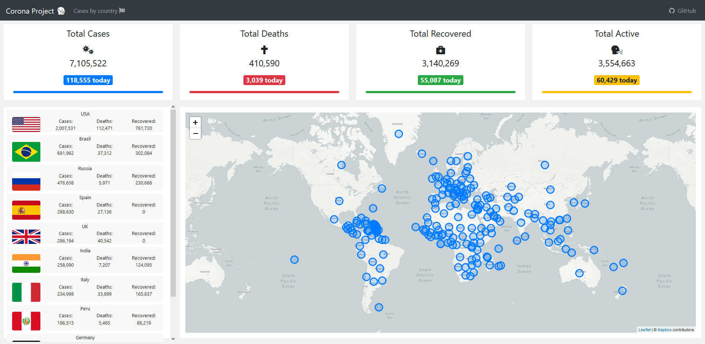
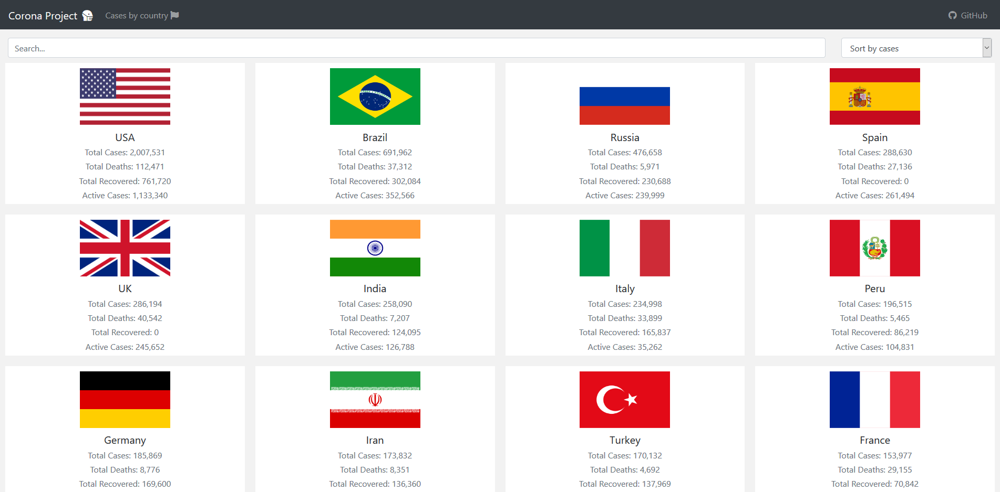
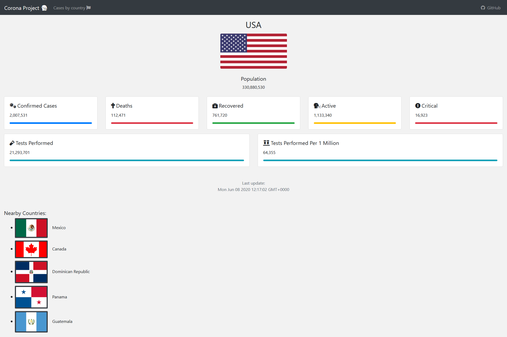

## Instructions

### Install all dependencies

```
npm install
```

### Run the server

```
npm run server
```

#### .env configuration file

Make sure you have the following values in your .env file:

```
SERVER_PORT={PORT}

MONGO_URI={URI}

MAPBOX_API_KEY={KEY}
```

### Run the React frontend

```
npm run start
```

### Screenshots

#### Homepage



#### Country list



#### Country stats


